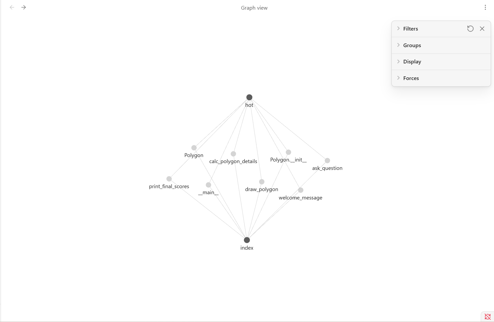
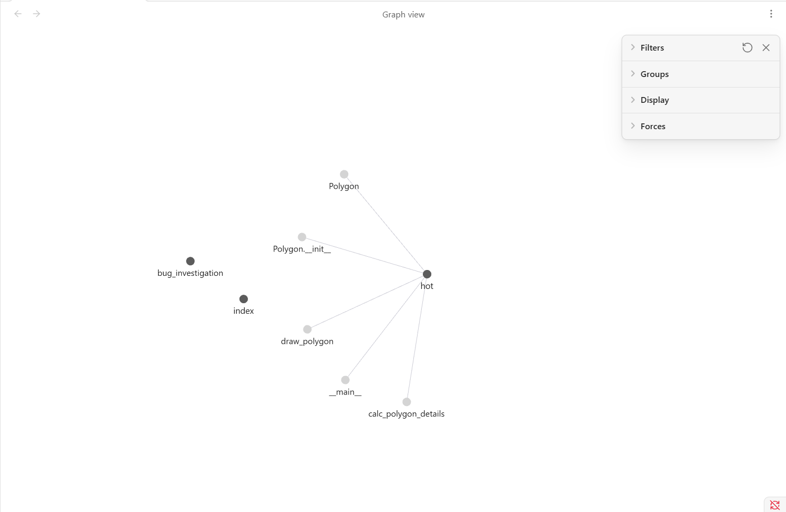
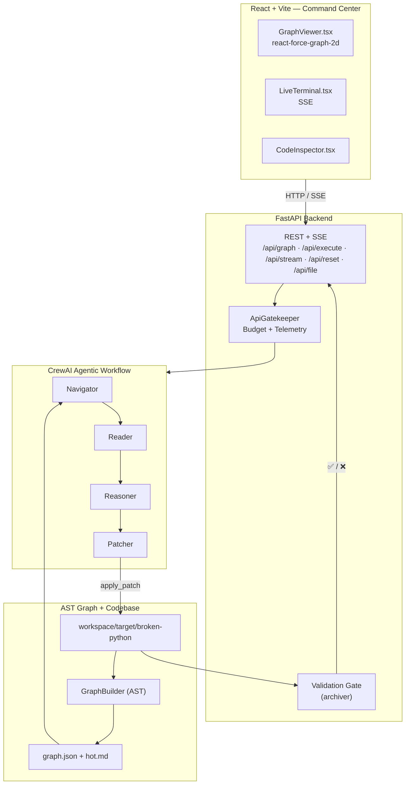
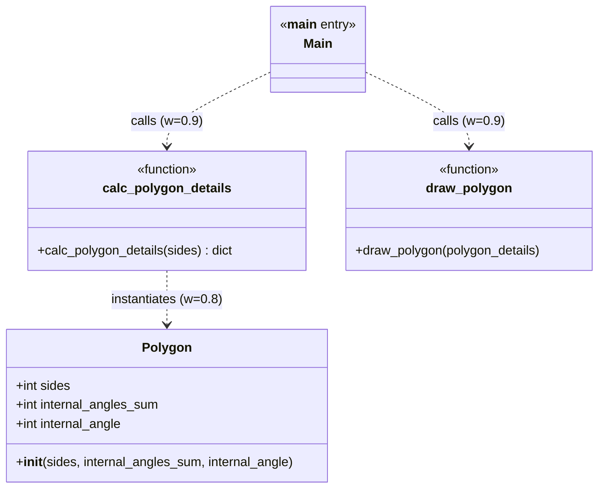
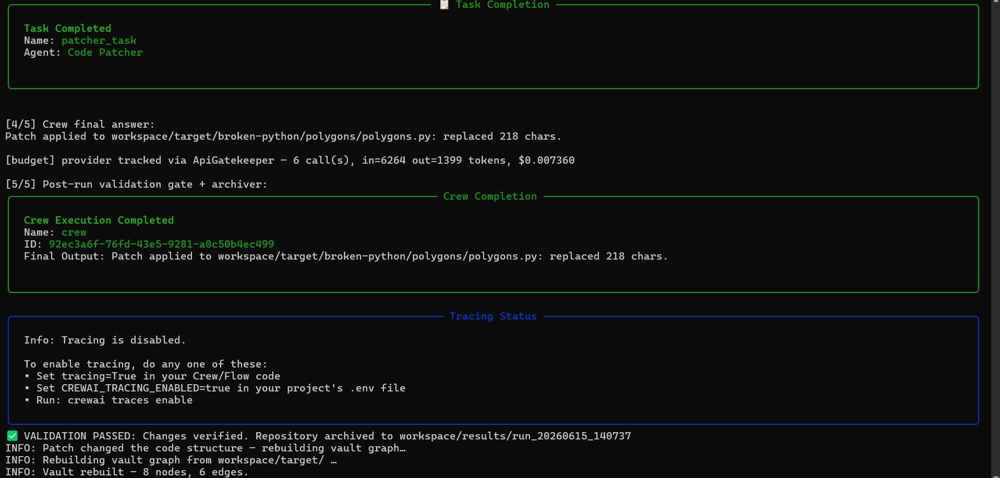
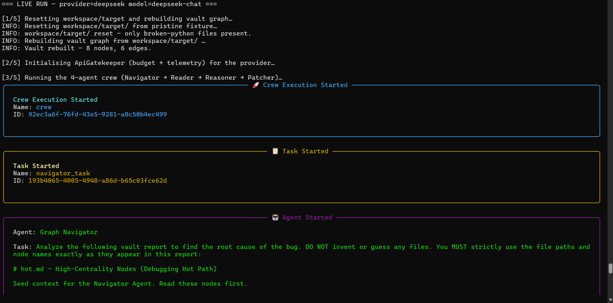
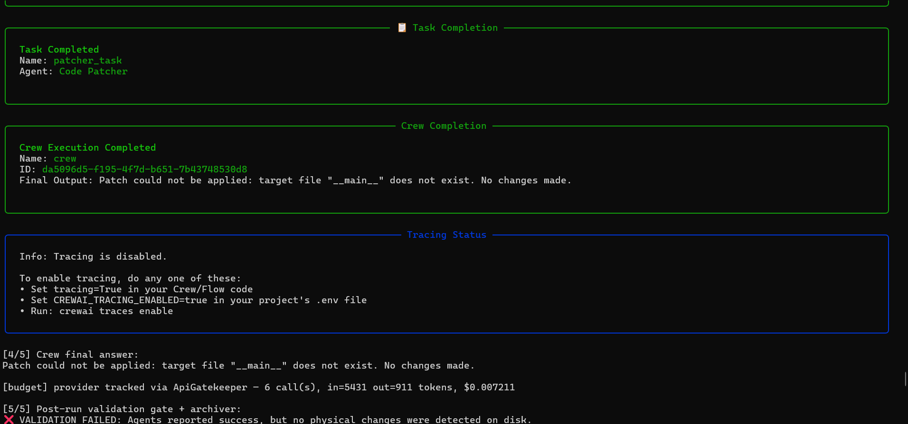
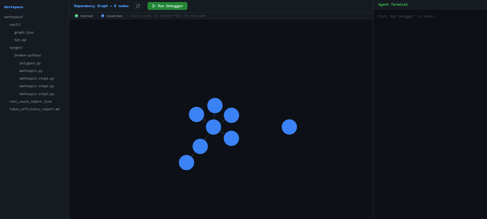
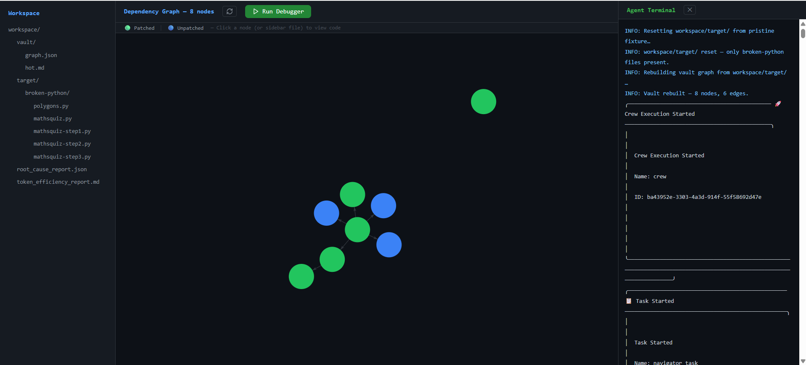
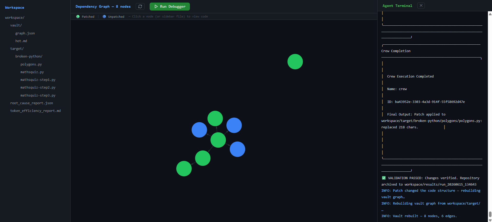

# EX04 — Reverse Engineering, Debugging and Token-Efficient Agentic AI with Grphify and Obsidian

## 1. מבט על (Overview)

פרויקט זה הוא **Agentic Debugging System** — מערכת אוטונומית מבוססת **CrewAI**
שמתקנת באגים ב-repo יעד באמצעות **Graph-Guided Debugging**: ניתוח ה-**AST**
(Abstract Syntax Tree) של הקוד ל-knowledge graph, זיהוי ה-**hot path** (אזור
היעד), והפעלת צוות של ארבעה agents לתיקון מינימלי ומאומת.

**Contributors:** Naji · Amjad

המערכת מורכבת משלוש שכבות: **React + Vite Command Center** (ויזואליזציה של ה-AST
דרך `react-force-graph-2d`), **FastAPI Backend** (orchestration + SSE streaming),
ו-**Agentic Workflow** (Navigator → Reader → Reasoner → Patcher) שכל קריאות
ה-LLM שלו עוברות דרך **ApiGatekeeper** ל-budget ו-telemetry. שער **Validation
Gate** מאמת שכל "תיקון" אכן שינה את הקוד פיזית על הדיסק לפני שהוא מתקבל.

---

## 2. מאגר בסיס (Base Repository)

בחרנו ב-**`martinpeck/broken-python`** כ-repo היעד. זהו אוסף סקריפטים לימודיים
עם באגים מכוונים (intentional bugs) — נקודתיים, ריאליסטיים ומבודדים — ולכן הוא
מושלם ל-**targeted agentic debugging**: כל סקריפט מכיל באגים אמיתיים (NameError,
SyntaxError, LogicError) ללא תלות ב-framework חיצוני, מה שמאפשר הרצה ואימות
מלאים בסביבת WSL/Windows.

---

## 3. שאלות מחקר והבנה (Research Questions)

### 3.1 ארכיטקטורה שהתגלתה מול הנחות ראשוניות

ההנחה הראשונית הייתה שה-repo מורכב מ-**flat scripts** בלבד (כמו מודול
`mathsquiz/` — סקריפטים שטוחים של חידון מתמטי, ללא מבנה מחלקות). אך ה-**reverse
engineering** דרך ה-AST graph חשף ש-`polygons/polygons.py` הוא דווקא קוד
**OOP** אמיתי: מחלקה `Polygon`, מתודה `__init__`, ושרשרת קריאות מרובת-הופים
(`__main__` → `calc_polygon_details` → `Polygon`). לכן בחרנו את `polygons.py`
כיעד — רק בו יש מספיק מבנה כדי להדגים את היתרון של ניווט מבוסס-graph.

| | **לפני (Before)** — הקוד הבאגי | **אחרי (After)** — לאחר התיקון |
|---|---|---|
| Obsidian ForceGraph |  |  |

### 3.2 God Nodes

ניתוח ה-**degree centrality** זיהה את צומת ה-**`__main__`** (module entry point,
L1–69) כ-**God Node** המרכזי: כל הזרימה מתחילה ממנו (centrality ≈ 0.667), והוא
מהווה את שורש ה-**bug call chain**. הצומת `calc_polygon_details` הוא ה-hub
המשני שמדרבן את ה-Reader לקרוא דווקא אותו תחילה.

### 3.3 ה-Bug Root Cause

ה-**Root Cause** שזוהה הוא **NameError** ב-`polygons/polygons.py` שורה 3:

```python
class Polygon(Object):   # ❌ אין built-in בשם Object (אות גדולה)
```

ב-Python הבסיס התקין הוא `object` (אות קטנה); ה-`Object` הלא-מוגדר מפיל את
המודול כבר ב-import time.

### 3.4 Graph-Guided מול קריאה לינארית נאיבית

| גישה | מה נקרא ל-context | יעילות |
|---|---|---|
| **Naive linear reading** | כל 75 השורות של `polygons.py` (כולל boilerplate) | סורק קוד לא-רלוונטי, סובל מ-Lost in the Middle |
| **Graph-Guided** | רק ה-hot-node slices: `Polygon` (L3–8) + `calc_polygon_details` (L13–36) ≈ 24 שורות | מתמקד ישירות ב-Root Cause, ~68% פחות הקשר |

---

## 4. תרשימי הנדסה לאחור (Engineering Diagrams) — §5.2

### 4.1 Block Diagram — ארכיטקטורת המערכת



### 4.2 Class Diagram — `polygons.py`



---

## 5. הוכחת חיסכון בטוקנים (Token Efficiency Proof)

כל קריאת LLM — כולל provider מסוג **DeepSeek** — מיורטת על-ידי ה-**ApiGatekeeper**
ונרשמת ב-**BudgetTracker**. ה-**ledger** של ההרצה `run_20260615_140737`:

| Metric | Value |
|---|---|
| Total API calls | 6 |
| Input tokens (billed) | 6,312 |
| Output tokens (billed) | 1,430 |
| Total cost (USD) | ~$0.0074 |

**מנגנון החיסכון — Context Isolation דרך ה-AST:** במקום להזריק את הקובץ המלא,
ה-**Reader** מושך אך ורק את ה-hot-node slices שזיהה ה-graph — `Polygon` (L3–8)
ו-`calc_polygon_details` (L13–36) — כ-**24 שורות מתוך 75**, כלומר **~68% פחות
שורות/tokens בהקשר הממוקד** לעומת naive full-file dump. היתרון גדל באופן יחסי
ככל שגודל ה-codebase עולה (פתרון ל-**Token Bloat** ול-**Lost in the Middle**).

> הערה: ה-ledger לעיל מודד את צריכת ה-session המלאה (כולל overhead של ה-framework
> ושל ארבעת ה-agents). ה-~68% מתייחס ל-**reduction בהקשר הממוקד** ברמת ה-Reader —
> זהו המנגנון, והוא זה שמתמרץ חיסכון אמיתי ב-repos גדולים.



---

## 6. תהליך עבודת הסוכנים (Agent Workflow)

ה-pipeline פועל ברצף (sequential) של ארבעה agents:

1. **Navigator** — מקבל את `hot.md` (force-fed) ומזהה את אזור הבאג ואת ה-target file.
2. **Reader** — מושך targeted slices בלבד (capped ב-read limit, מתאפס בכל run).
3. **Reasoner** — מפיק **Hypothesis JSON** עם `target_file`, `root_cause`,
   ו-`confidence_score`.
4. **Patcher** — מחיל `apply_patch` עם ה-diff המינימלי, רק אם confidence ≥ 0.7.



### ה-Validation Gate — חסימת hallucinations

החידוש המרכזי: ה-**backend Validation Gate** לא סומך על דיווח ה-LLM. לאחר כל
הרצה הוא משווה פיזית את `workspace/target/` מול ה-pristine fixture:

- **❌ נחסם (blocked):** במקרים שבהם ה-Patcher **הזה (hallucinated)** מחרוזת
  הצלחה ("Patch applied…") אך לא בוצע שום שינוי על הדיסק (למשל ניסיון לתקן
  מתודה שלא קיימת, או patch טריוויאלי). השער זיהה שאין diff פיזי והכריז
  `❌ VALIDATION FAILED`, מבלי לארכב דבר.



- **✅ עבר (passed):** רק שינוי פיזי אמיתי ומאומת — התיקון `class Polygon(Object)`
  ‏→‏ `class Polygon(object)` — עבר את השער, וההרצה אורכבה ל-`workspace/results/`.

כך אנו מבטיחים ש**רק verifiable physical changes** מתקבלים, ו-LLM formatting
hallucinations נחסמים אוטומטית.

---

## 7. הרחבות ויוזמות מקוריות (Original Initiatives) — §5.6

בנינו **decoupled React + Vite Interactive Command Center** — לא רק CLI אלא
dashboard חי. הרכיב המרכזי `ui/src/components/GraphViewer.tsx` מצייר את ה-**AST
knowledge graph** באמצעות **`react-force-graph-2d`**, ומתעדכן בזמן אמת:

- **Dynamic node coloring** — צמתים של קבצים שעברו patch נצבעים בירוק (`#22c55e`)
  על בסיס parsing של ה-SSE stream; שאר הצמתים בכחול (`#3b82f6`).
- **LiveTerminal** — streaming של לוגי הסוכנים דרך SSE (`/api/stream`).
- **CodeInspector** — לחיצה על node פותחת את קוד המקור (כולל ה-patch) דרך
  `/api/file`.
- **Reset Workspace** — כפתור שמשחזר את הקוד הבאגי הנקי ובונה מחדש את ה-graph.

| לפני הריצה (Before) | אחרי הריצה (After) |
|---|---|
|  |  |



---

## 8. הוראות הרצה (Setup & Run Instructions)

### דרישות מקדימות
- Python ≥ 3.12 עם **uv**, ו-Node.js (עבור ה-UI).
- קובץ `.env` בשורש הפרויקט עם `LLM_PROVIDER` (`claude` או `deepseek`) ומפתח
  ה-API המתאים.

### Backend — FastAPI
```bash
uv sync
uv run uvicorn crewai_graphify.server:app --reload \
  --reload-exclude "fixtures/*" --reload-exclude "workspace/*"
```

### Frontend — React + Vite
```bash
cd ui
npm install
npm run dev      # http://localhost:5173  (proxy ל-/api → localhost:8000)
```

### הרצה מהטרמינל (ללא UI)
```bash
uv run python scripts/live_run.py
```

### בדיקות (Quality Gates)
```bash
uv run pytest            # 237 tests · ~96% coverage
uv run ruff check .      # lint
cd ui && npm run test    # vitest (UI utilities)
```
